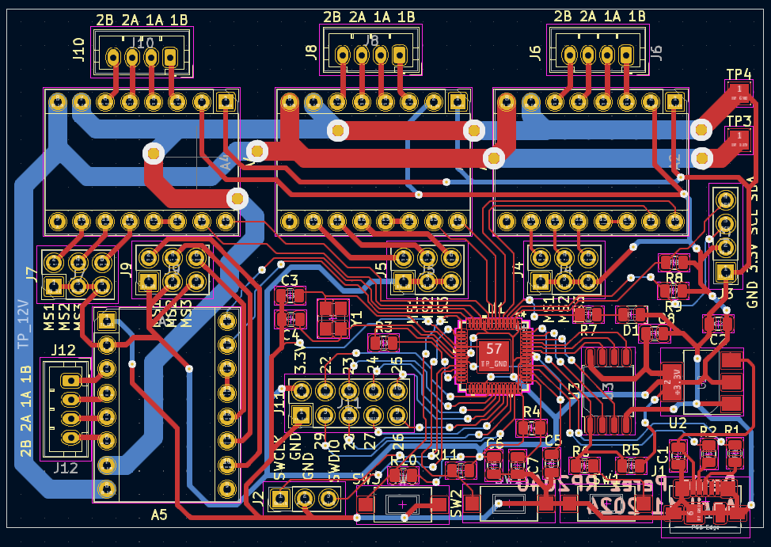
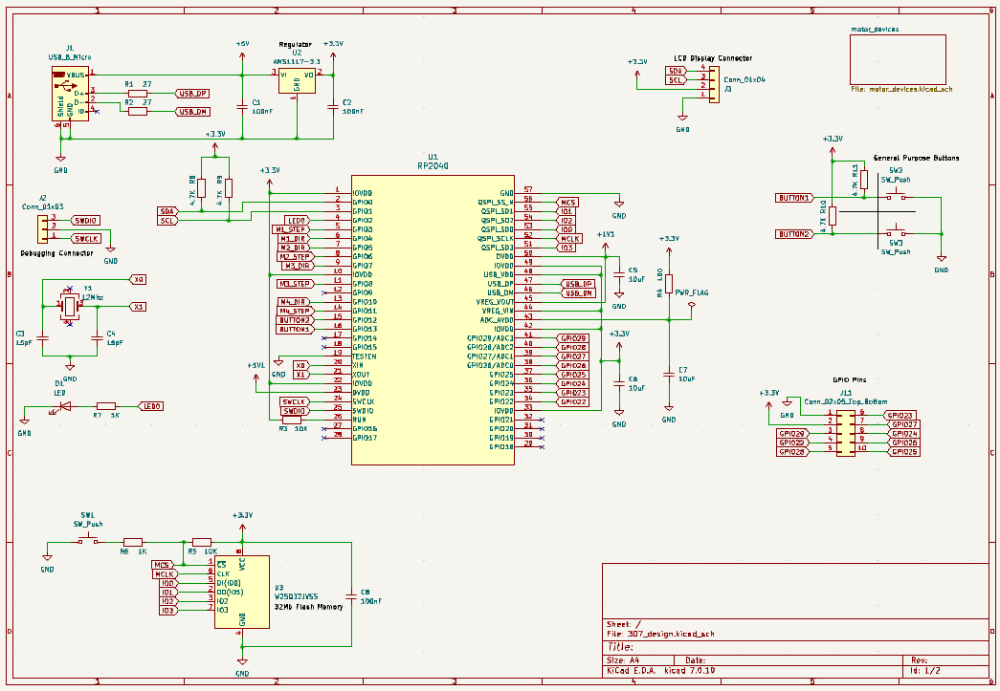
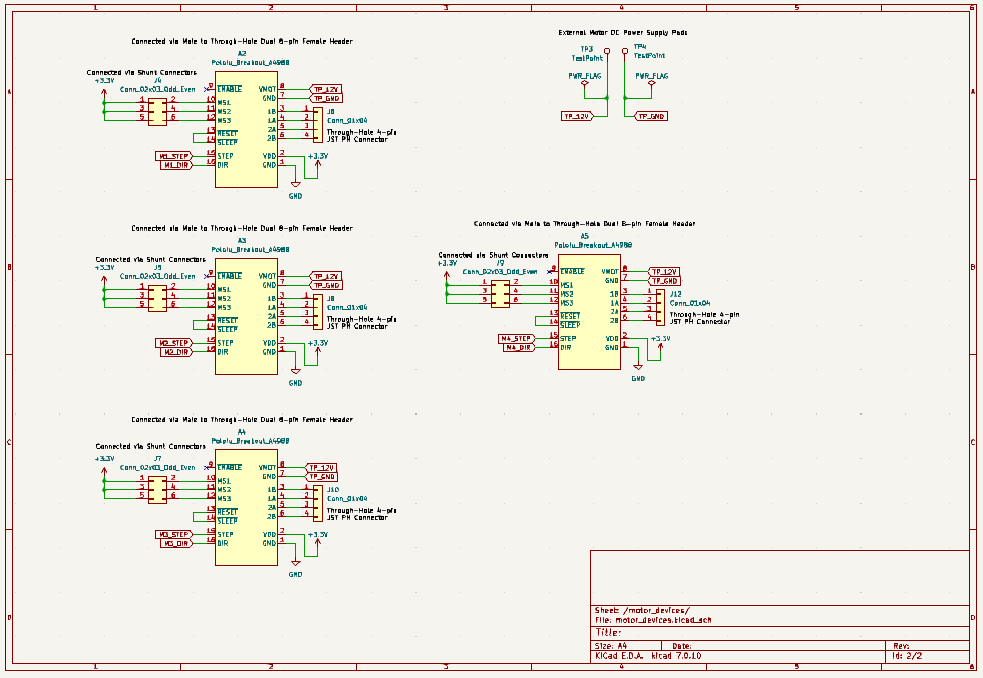

# rp2040-stepper-controller
This project utilizes the RP2040 microcontroller and A4988 motor drivers on a custom PCB to control NEMA-17 stepper motors. This PCB is equipped with four A4988 providing the ability to drive multiple motors from a single microntroller. Headers pins provide the ability of micro-stepping for each motor. The micro-USB allows for easy flashing from a host machine. The 32MB of external flash memory provide the ability to flash large programs.

## Demo (Click Thumbnail to see Youtube video)

## PCB Snapshots

## Schematic Snapshots

